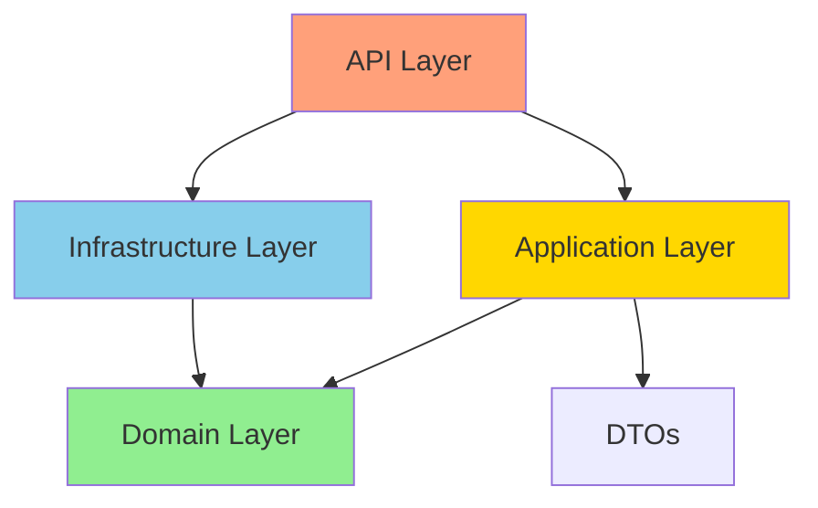
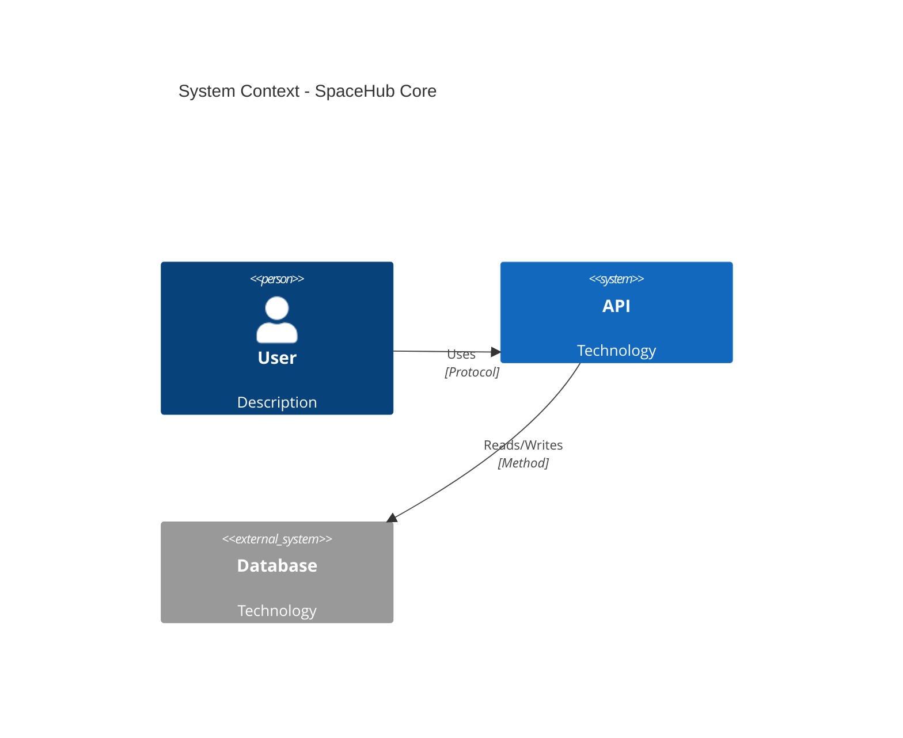
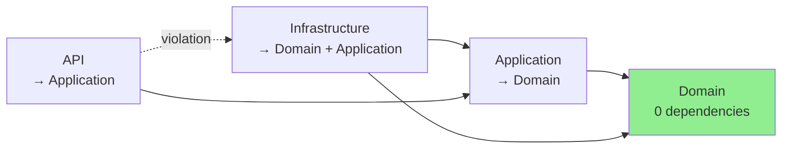
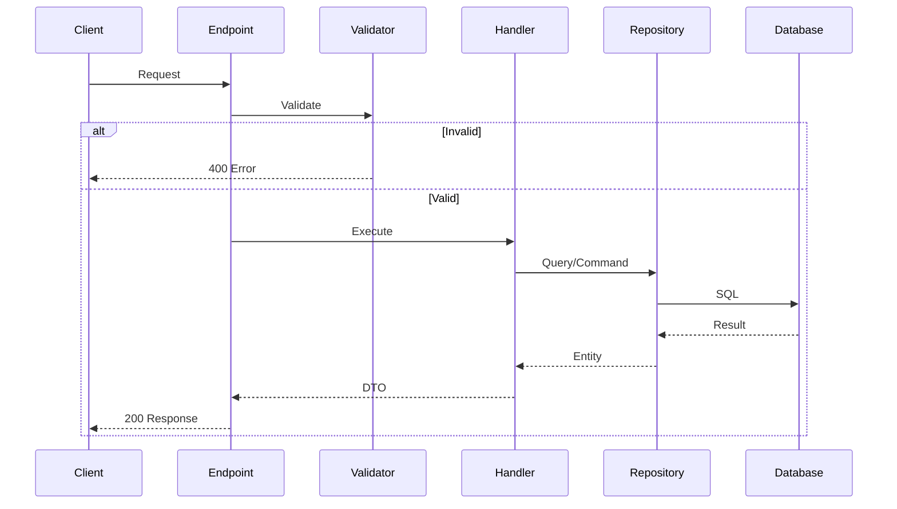
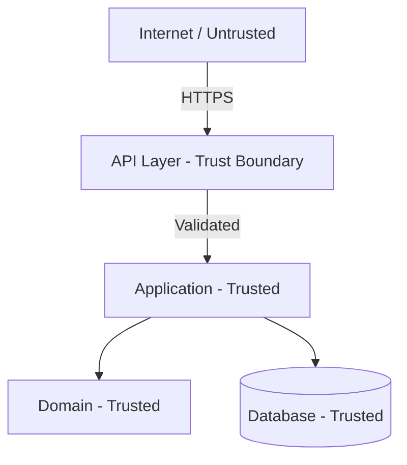

# Architecture Review

Perform comprehensive system architecture analysis and improvement planning: **$ARGUMENTS**

## Current Architecture Context

**Project-Specific Context**:

- **Documentation**: Do not rely solely on existing documentation in the repository; use it as a starting point but verify and expand through analysis of the actual codebase
- **Project Structure**: Should be organized per Clean Architecture with layered structure under `src/` directory
  - `tests/` - should contain all test projects
- **Tech Stack**: Analyse existing tech stack usage
- **Package Dependencies**: Extract from files e.g. `.csproj` files and verify against latest stable versions via NuGet/web search to identify outdated dependencies
- **Testing**: Identify curtrent in use testing frame works, patterns and code coverage. Identify if test driven development has been used and to what extent

## Task

Execute comprehensive architectural analysis with actionable improvement recommendations:

**Review Scope**: Use $ARGUMENTS to focus analysis on specific areas when requested:

- **Module-specific**: "Organizations module", "Authentication", "Validation subsystem"
- **Pattern-focused**: "Repository pattern", "CQRS implementation", "Factory patterns", "Result pattern"
- **Domain-focused**: "Dependency analysis", "Security architecture", "Performance bottlenecks"
- **Default**: If no arguments provided, perform full architecture review across all areas.

**Architecture Analysis Framework** (6 Core Dimensions):

1. **System Structure Assessment** (20 points)
   - Map component hierarchy and architectural layers
   - Identify implemented architectural patterns (e.g. Clean Architecture, CQRS, etc.)
   - Analyze module boundaries and feature organization
   - Assess layer separation and dependency flow (e.g. Domain → Application → Infrastructure → API)
   - Detect boundary violations (e.g., API directly using Infrastructure)

2. **Design Pattern Evaluation** (20 points)
   - Identify implemented patterns (Repository, Unit of Work, Factory, Specification, Strategy, etc.)
   - Assess pattern consistency across codebase
   - Detect anti-patterns (Anemic Domain Model, God Objects, Leaky Abstractions, etc.)
   - Evaluate pattern effectiveness and appropriate usage
   - Compare entity creation approaches (factory methods vs. public constructors)

3. **Dependency Architecture** (15 points)
   - Analyze coupling levels (Afferent/Efferent coupling, Instability metrics)
   - Detect circular dependencies between layers/modules
   - Evaluate dependency injection configuration and lifetime management
   - Assess architectural boundaries and dependency inversion compliance
   - Review DI container registrations (Scoped, Transient, Singleton)

4. **Data Flow Analysis** (15 points)
   - Trace information flow through layers (e.g. API → Application → Domain → Database)
   - Evaluate state management patterns (e.g. EF Core Change Tracker, distributed state, etc.)
   - Assess data persistence strategies (e.g. EF Core vs. Dapper usage, query optimization)
   - Validate data transformation patterns (e.g. DTO mapping, entity-to-DTO conversions)
   - Identify N+1 query problems and missing Include statements

5. **Scalability & Performance** (15 points)
   - Analyze horizontal/vertical scaling capabilities
   - Evaluate caching strategies (e.g. response caching, distributed caching, query caching)
   - Assess database performance (e.g. indexes, connection pooling, query patterns)
   - Review resource management (e.g. async/await, CancellationToken, IAsyncDisposable)
   - Identify bottlenecks (e.g. ltree queries on large trees, JSONB queries without indexes)

6. **Security Architecture** (15 points)
   - Review trust boundaries and input validation points
   - Assess authentication patterns (e.g. cookie-based, JWT, password hashing)
   - Analyze authorization flows (e.g. role-based, policy-based, claims-based)
   - Evaluate data protection (e.g. encryption at rest/in transit, PII handling in logs)
   - Check for common vulnerabilities (e.g. SQL injection, CSRF, mass assignment, etc.)
   - Review multi-tenancy isolation (e.g. EF Global Query Filters, tenant discriminators)

Note: use your anaysis to determine techstack and architectural patterns in use and undertake research into best practice recommendations for those specific technologies and patterns as part of your analysis. Ensure references and links are included in the fianl report.

**Scoring Criteria**:

- Assign 0-100 overall score with breakdown by dimension (e.g., System Structure: 18/20)
- Use priority indicators: 🔴 Critical (0-4), 🟡 High (5-7), 🟢 Medium (8-10) for individual findings
- Provide letter grade: A (90-100), B (80-89), C (70-79), D (60-69), F (<60)

**Advanced Analysis Topics**:

- Component testability (mockability, test coverage, test data generation)
- Configuration management (appsettings, user-secrets, environment variables, validation)
- Error handling patterns (exceptions vs. `Result<T>`, global exception handlers)
- Monitoring & observability integration (Serilog, .NET Aspire Dashboard, OpenTelemetry)
- Extensibility assessment (plugin architecture, feature flags, versioning strategies)

**Quality Assessment**:

- Code organization (namespace consistency, file/class naming, folder structure)
- Documentation adequacy (XML comments, README files, ADRs, inline comments)
- Team communication patterns (PR templates, commit message quality)
- Technical debt evaluation (effort estimates in ideal development days)

**Required Visualizations** (Use Mermaid diagrams):

1. **Component Hierarchy**: `graph TD` showing Domain ← Application ← Infrastructure ← API relationships
2. **Dependency Flow**: `graph LR` with violations highlighted in red dotted lines
3. **Sequence Diagram**: Typical request/response flow (e.g., CreateProject command execution)
4. **C4 Context Diagram**: System boundaries, external systems (PostgreSQL, .NET Aspire)
5. **Data Flow**: Complex operations like Room creation with validation, field set migration, hierarchy updates

**Output Format**: Detailed architecture assessment with:

- Specific improvement recommendations with code examples (bad vs. good)
- Refactoring strategies with file paths and line numbers
- Implementation roadmap organized into 4 phases with effort estimates
- Risk assessment matrix (likelihood × impact × mitigation priority)
- Technical debt inventory with prioritization

## Report Format

Report findings in structured markdown format saved to `.Analysis/Review_YYYYMMDD.md` (timestamp for one run per day) with concise summary output to console/cli.

Note if a full or extensive review is requested/ undertaken, the size of the report may exceed your output token limit, so in this scenario you must split into seperate documents, with an overview document providing a summary and links. These seperate documents should follow the **Architecture Analysis Framework** elements e.g. `.Analysis/Review_YYYYMMDD_Security_Architecture.md`.  

### Architecture Review Report Structure

```markdown
# Architecture Review Report
**Generated**: {YYYY-MM-DD HH:mm:ss}
**Scope**: {Full Review | Module-Specific | Pattern Analysis | Security Focus | Performance Analysis}
**Reviewer**: Claude Code ({Model Name / Version})
**Repository**: {Repository Name}

---

## Executive Summary

### Overall Architecture Health Score: X/100 (Grade: A/B/C/D/F)

| Dimension | Score | Status | Priority |
|-----------|-------|--------|----------|
| System Structure | X/20 | 🟢 Good / 🟡 Fair / 🔴 Needs Work | High/Medium/Low |
| Design Patterns | X/20 | ... | ... |
| Dependency Architecture | X/15 | ... | ... |
| Data Flow & State Management | X/15 | ... | ... |
| Scalability & Performance | X/15 | ... | ... |
| Security Architecture | X/15 | ... | ... |

**Key Findings** (Top 3-5 most critical items):
1. ✅ **Strength**: [Brief description of architectural strength]
2. ⚠️ **Concern**: [Medium-priority issue requiring attention]
3. 🔴 **Critical**: [High-priority issue blocking production readiness]

**Recommended Focus Areas** (in priority order with effort estimates):
1. [🔴 HIGH] [Action item] - Est. X days
2. [🟡 MEDIUM] [Action item] - Est. X days
3. [🟢 LOW] [Action item] - Est. X days

---

## 1. System Structure Assessment

### 1.1 Component Hierarchy



**Findings**:

- ✅ [Positive finding with explanation]
- ⚠️ [Warning with specific file references]
- 🔴 [Critical issue with impact assessment]

### 1.2 Module Boundaries

**Analyzed Modules**:

- [List of major modules/features analyzed]

**Boundary Violations Detected**:

```text
❌ [File path]:line
   → [Description of violation]
   ✓ Fix: [Specific recommendation]

⚠️ [File path]:line
   → [Description of concern]
   ✓ Fix: [Specific recommendation]
```

### 1.3 Layered Design Compliance

| Layer | Compliance | Issues Found |
| ------- | ------------ | -------------- |
| Domain | X% ✅/⚠️/🔴 | [Issue count and description] |
| Application | X% | ... |
| Infrastructure | X% | ... |
| API | X% | ... |

**Architecture Diagram (Current State)**:



---

## 2. Design Pattern Evaluation

### 2.1 Identified Patterns

| Pattern | Location | Implementation Quality | Notes |
| --------- | ---------- | ------------------------ | ------- |
| Repository | [File path] | ✅ Excellent / 🟡 Partial / 🔴 Poor | [Brief assessment] |
| Unit of Work | ... | ... | ... |
| Factory | ... | ... | ... |
| CQRS | ... | ... | ... |
| Specification | ... | ... | ... |

### 2.2 Pattern Consistency

**Inconsistencies Detected**:

1. **[Pattern Name]**:
   - [Description of inconsistency across codebase]
   - **Recommendation**: [Standardization approach]

### 2.3 Anti-Patterns Detected

🔴 **Critical Anti-Patterns**:

```csharp
// ❌ ANTI-PATTERN: [Name]
// Location: [File path]:line
[Code example showing problem]

// ✓ RECOMMENDED: [Pattern name]
[Code example showing solution]
```

⚠️ **Medium Concerns**:

- **[Anti-pattern name]**: [Description and impact]

---

## 3. Dependency Architecture

### 3.1 Dependency Graph



### 3.2 Coupling Analysis

**Afferent Coupling (Ca)** - How many modules depend on this:

**Efferent Coupling (Ce)** - How many modules this depends on:

**Instability Metric** (Ce / (Ce + Ca)):

### 3.3 Circular Dependencies

✅ **None detected** - [Explanation]
OR
🔴 **Detected**: [Description with file paths]

### 3.4 Dependency Injection Health

**DI Container Registration Analysis**:

```text
✅ [Service type]: [Lifetime] (assessment)
⚠️ [Service type]: [Issue description]
   → Recommendation: [Fix]
```

---

## 4. Data Flow Analysis

### 4.1 Information Flow Mapping



### 4.2 State Management Evaluation

**Current Approach**:

- ✅ [Positive aspect]
- ⚠️ [Gap or concern]
- 🔴 [Critical missing component]

**Recommendations**:

1. [Specific improvement with justification]

### 4.3 Data Persistence Strategies

| Entity | Strategy | Performance | Notes |
| -------- | ---------- | ------------- | ------- |
| [Entity] | [ORM/Dapper/Hybrid] | ✅/🟡/🔴 | [Assessment] |

**Query Performance Concerns**:

```sql
-- ⚠️ DETECTED: [Issue name]
-- Location: [File path]:line
[Problematic query or code]

-- ✓ RECOMMENDED:
[Optimized query or code]
```

### 4.4 Data Transformation Patterns

**DTO Mapping**:

- [Current approach and assessment]
- **Recommendation**: [Improvement suggestion]

---

## 5. Scalability & Performance

### 5.1 Scaling Capabilities

**Current Architecture Supports**:

- ✅ [Scaling capability with explanation]
- ⚠️ [Limitation with impact]

**Bottlenecks Identified**:

1. **[Bottleneck name]**:
   - **Risk**: [Impact description]
   - **Fix**: [Specific solution with code/config example]

### 5.2 Caching Strategy

**Current State**: ✅ Implemented / ⚠️ Partial / ❌ Not implemented

**Recommendations** (Priority Order):

1. **[Caching type]** ([Priority]):

   ```csharp
   [Code example or configuration]
   ```

### 5.3 Resource Management

**Analysis**:

- ✅ [Positive finding]
- ⚠️ [Warning]
- 🔴 [Critical missing pattern]

---

## 6. Security Architecture

### 6.1 Trust Boundaries



**Findings**:

- ✅ [Security control in place]
- ⚠️ [Concern with mitigation]
- 🔴 [Critical gap requiring immediate action]

### 6.2 Authentication & Authorization

**Current Implementation**:

```text
Authentication: [Method] ✅/⚠️/❌
Authorization: [Method] ✅/⚠️/❌
Multi-tenancy: [Approach] ✅/⚠️/❌
```

**Critical Gaps**:

1. **[Gap name]**:
   - **Risk**: [Security impact]
   - **Fix**: [Implementation approach with code example]

### 6.3 Data Protection

| Asset | Protection | Status | Notes |
| ------- | ------------ | -------- | ------- |
| Passwords | [Method] | ✅/⚠️/🔴 | [Assessment] |
| API Tokens | [Method] | ... | ... |
| PII in Logs | [Method] | ... | ... |
| Database at Rest | [Method] | ... | ... |
| Database in Transit | [Method] | ... | ... |

**Sensitive Data in Code**:

```csharp
// ⚠️ POTENTIAL LEAK: [File path]:line
[Problematic code]

// ✓ RECOMMENDED:
[Safe alternative]
```

### 6.4 Dependency Vulnerabilities

**Scan Results** (as of {date}):

```text
✅ [Finding]
⚠️ [Recommendation]
```

---

## 7. Advanced Analysis

### 7.1 Testability Assessment

**Test Coverage**:

- [Coverage statistics and assessment]

**Testability Concerns**:

1. [Issue with impact on testing]

**Recommendations**:

```csharp
// [Testability improvement example]
```

### 7.2 Configuration Management

**Current Approach**:

- ✅ [Positive aspect]
- ⚠️ [Concern]

**Recommendations**:

1. [Improvement with example]

### 7.3 Error Handling Patterns

**Current State**:

- [Analysis of consistency across layers]

**Consistency Recommendation**:

```csharp
// Option 1: [Approach name]
[Code example]

// Option 2: [Alternative approach]
[Code example]

// ✓ RECOMMENDATION: [Pick one and justify]
```

### 7.4 Observability Integration

**Current State**:

- ✅ [Implemented capability]
- ⚠️ [Gap]
- ❌ [Missing component]

**Quick Wins**:

```csharp
// [Code example for easy improvement]
```

---

## 8. Quality Metrics

### 8.1 Code Organization Score: X/100

| Metric | Score | Details |
| -------- | ------- | --------- |
| Namespace Consistency | X% | [Assessment] |
| File/Class Name Alignment | X% | ... |
| StyleCop Compliance | X% | ... |
| Feature Cohesion | X% | ... |
| Single Responsibility | X% | ... |

### 8.2 Documentation Adequacy: X/100

**Strengths**:

- ✅ [Documentation strength]

**Gaps**:

- ⚠️ [Documentation gap]
- 🔴 [Critical missing documentation]

### 8.3 Technical Debt Inventory

**Estimated Debt** (in ideal development days):

| Category | Item | Effort | Priority |
|----------|------|--------|----------|
| [Category] | [Description] | X days | 🔴/🟡/🟢 |

**Total Debt**: ~X development days (~X sprint weeks)

---

## 9. Improvement Roadmap

### Phase 1: [Focus Area] (Week 1)

**Goal**: [Specific outcome]

- [ ] **Task 1.1**: [Task description]
  - **Files**: [File paths to modify]
  - **Acceptance**: [Definition of done]
  - **Effort**: X days

- [ ] **Task 1.2**: [Task description]
  - **Files**: [File paths]
  - **Acceptance**: [Criteria]
  - **Effort**: X days

**Phase 1 Total**: X days

### Phase 2: [Focus Area] (Week 2)

**Goal**: [Specific outcome]

[Same structure as Phase 1]

**Phase 2 Total**: X days

### Phase 3: [Focus Area] (Week 3)

**Goal**: [Specific outcome]

[Same structure as Phase 1]

**Phase 3 Total**: X days

### Phase 4: [Focus Area] (Week 4)

**Goal**: [Specific outcome]

[Same structure as Phase 1]

**Phase 4 Total**: X days

---

## 10. Conclusion

### 10.1 Architecture Maturity Assessment

**Overall Grade**: **[A/B/C/D/F] (X/100)** - [One-sentence summary]

**Strengths to Preserve**:

1. ✅ **[Strength]**: [Description]

**Critical Improvements Needed**:

1. 🔴 **[Improvement]**: [Description and rationale]

### 10.2 Risk Assessment

| Risk | Likelihood | Impact | Mitigation Priority |
|------|------------|--------|---------------------|
| [Risk description] | High/Medium/Low | Critical/High/Medium/Low | 🔴/🟡/🟢 Priority |

### 10.3 Next Steps

**Immediate Actions** (This Week):

1. [Action item]
2. [Action item]

**Long-Term Recommendations**:

1. [Strategic recommendation]
2. [Strategic recommendation]

---

**Report End** | Generated by Claude Code | [Full Repository: SpaceHub-Core](./)

```text

## Output Requirements

### Console/CLI Summary

Display this concise summary immediately after analysis completes:

```

╔════════════════════════════════════════════════════════════╗
║        Architecture Review Complete                        ║
╚════════════════════════════════════════════════════════════╝

Overall Score: X/100 (Grade: A/B/C/D/F)
Scope: {Full Review | Module | Pattern | Security | Performance}

┌─ Top 3 Findings ─────────────────────────────────────────┐
│ 🔴 [Critical] [Brief description]                        │
│ 🟡 [High]     [Brief description]                        │
│ 🟢 [Medium]   [Brief description]                        │
└──────────────────────────────────────────────────────────┘

┌─ Dimension Scores ───────────────────────────────────────┐
│ System Structure:        XX/20  [🟢/🟡/🔴]              │
│ Design Patterns:         XX/20  [🟢/🟡/🔴]              │
│ Dependency Architecture: XX/15  [🟢/🟡/🔴]              │
│ Data Flow:               XX/15  [🟢/🟡/🔴]              │
│ Scalability:             XX/15  [🟢/🟡/🔴]              │
│ Security:                XX/15  [🟢/🟡/🔴]              │
└──────────────────────────────────────────────────────────┘

Detailed report saved to:
  📄 .Analysis/Review_YYYYMMDD_.md

Total Technical Debt: ~XX development days

Next Steps:

  1. Review Phase 1 tasks (X.X days) - [Focus area]
  2. Create backlog items for prioritized improvements
  3. Schedule team architecture discussion
  4. {Additional context-specific next step if applicable}

═══════════════════════════════════════════════════════════

```md

### File Output Specifications

- **Directory**: `.Analysis/` (create if doesn't exist; add to `.gitignore` if not already present)
- **Filename Pattern**: `ArchitectureReview_YYYYMMDD_HHmmss.md` (e.g., `ArchitectureReview_20251020_143022.md`)
- **Format**: Complete markdown report following the template structure above
- **Encoding**: UTF-8 with LF line endings
- **Minimum Length**: Report should be substantive (2,000+ lines for full review, proportional for focused reviews)

## Quality Checklist

**Before finalizing the report, Claude Code must verify**:

- [ ] **Completeness**: All 6 analysis areas have substantive findings (not just "✅ Good" without details)
- [ ] **Visualizations**: At least 3 Mermaid diagrams included with proper syntax (component hierarchy, dependency graph, sequence diagram minimum)
- [ ] **Specificity**: Code examples use actual file paths from repository (e.g., `src/SpaceHub.Core.Domain/Entities/Room.cs:45`) not generic placeholders
- [ ] **Actionability**: Technical debt table includes effort estimates in days/hours
- [ ] **Roadmap**: Improvement roadmap has 4 phases with specific, measurable tasks
- [ ] **Risk Assessment**: Includes likelihood + impact + mitigation priority for top 5+ risks
- [ ] **Scoring Justification**: Overall score is justified with breakdown of all 6 dimensions showing calculation
- [ ] **File Creation**: Report successfully saved to `.Analysis/` directory with timestamped filename
- [ ] **Bad vs. Good Examples**: At least 3 code examples showing anti-pattern vs. recommended pattern
- [ ] **Priority Indicators**: Consistent use of 🔴/🟡/🟢 throughout for visual scanning
- [ ] **Cross-References**: Findings reference specific line numbers, not just file names
- [ ] **Mermaid Syntax**: All diagrams validated for correct Mermaid syntax (especially graph direction, node IDs, arrow types)
- [ ] **Effort Estimation**: All roadmap tasks have realistic effort estimates (0.5-5 days typical range)
- [ ] **Tech Stack Accuracy**: Analysis references actual technologies in use (PostgreSQL ltree, EF Core 9, Serilog, etc.), not generic assumptions

## Analysis Execution Guidelines

**Context Gathering** (Do this FIRST):
1. Read `CLAUDE.md` for project-specific context (architecture, tech stack, conventions)
2. Scan directory structure: `src/`, `tests/`, `.planning/`, `.specify/`
3. Identify all `.csproj` files and extract NuGet packages
4. Read key architectural files: entities, repositories, DbContext, API endpoints
5. Check for existing documentation: README files, ADRs, planning docs

**Deep Dive Analysis** (For each of 6 dimensions):
1. Use Glob to find relevant files (e.g., `**/*Repository.cs`, `**/Entities/*.cs`)
2. Use Grep to search for patterns (e.g., anti-patterns, security issues)
3. Read representative files from each layer
4. Document findings with specific file:line references
5. Assign scores based on severity and prevalence

**Synthesis & Reporting**:
1. Calculate dimension scores and overall score
2. Identify top 3-5 most critical findings
3. Create prioritized improvement roadmap (4 phases)
4. Generate Mermaid diagrams for visualization
5. Write complete report following template structure
6. Save to `.Analysis/ArchitectureReview_{timestamp}.md`
7. Display concise CLI summary

**Scope Adaptation** (Based on $ARGUMENTS):
- **No arguments**: Full review across all 6 dimensions
- **Module specified**: Focus on that module but cover all 6 dimensions within module scope
- **Pattern specified**: Deep dive on pattern usage across codebase
- **Domain specified** (e.g., "security", "performance"): Focus on relevant dimensions but mention others briefly
